# Regula Document Reader for Passport Processing

A comprehensive passport information extraction system using Regula's OCR technology with domain-specific validation and probability tracking.

## 🚀 Overview

This system processes passport images using Regula's document reader, applies country-specific validation rules, and outputs structured data with confidence scores. It's specifically designed for processing maid passport data with robust postprocessing and Google Sheets integration.

## 📋 Features

- **Regula OCR Integration**: Advanced passport field extraction with MRZ validation
- **Probability Tracking**: Regula confidence scores (0.0-1.0) for each extracted field
- **Country-Specific Rules**: Validation logic for 20+ countries (Philippines, Kenya, India, etc.)
- **Smart Postprocessing**: Date standardization, place validation, country mapping
- **Google Sheets Upload**: Automated results upload with probability scores
- **Robust Error Handling**: Graceful failure handling and debugging output

## 🔄 Validation & Postprocessing Flow

### Visual Pipeline Overview

```mermaid
flowchart TD
    A["📸 Passport Images<br/>(JPG/PNG files)"] --> B["🔍 Regula OCR Engine<br/>+ MRZ Validation"]
    
    B --> C["📊 Field Mapping<br/>regula_mapper.py"]
    C --> C1["Normalize Probabilities<br/>(0-100 → 0.0-1.0)"]
    C1 --> C2["Apply Source Preferences<br/>(MRZ vs VISUAL)"]
    C2 --> D["🧠 Universal Format<br/>{fields + probabilities}"]
    
    D --> E["🔧 Core Postprocessing<br/>passport_processing.py"]
    E --> E1["📅 Date Standardization<br/>(dd/mm/YYYY + century expansion)"]
    E1 --> E2["🌍 Country Validation<br/>(name → 3-letter code)"]
    E2 --> E3["📍 Place → Country Mapping<br/>(fuzzy matching)"]
    E3 --> E4["✨ String Cleaning<br/>(unidecode + normalize)"]
    
    E4 --> F{"🏛️ Country<br/>Detection"}
    F -->|PHL| G1["🇵🇭 Philippines Rules<br/>- Document # validation<br/>- Family field clearing"]
    F -->|KEN| G2["🇰🇪 Kenya Rules<br/>- Prefix validation<br/>- Place standardization"]
    F -->|IND| G3["🇮🇳 India Rules<br/>- Name rearrangement<br/>- Probability transfer"]
    F -->|ETH| G4["🇪🇹 Ethiopia Rules<br/>- Format validation"]
    F -->|Other| G5["🌐 Generic Rules<br/>- Basic validation"]
    
    G1 --> H["💯 Probability Adjustment<br/>min(original, validation)"]
    G2 --> H
    G3 --> H
    G4 --> H
    G5 --> H
    
    H --> I["📄 CSV Output<br/>+ Individual probability columns"]
    I --> J["📊 Google Sheets Upload<br/>with confidence scores"]
    
    style A fill:#e1f5fe
    style B fill:#f3e5f5
    style D fill:#e8f5e8
    style F fill:#fff3e0
    style H fill:#fce4ec
    style I fill:#f1f8e9
    style J fill:#e3f2fd
```



### Key Processing Steps

#### 1. **Regula OCR Processing** 🔍
- Extract all passport fields with raw confidence scores (0-100)
- Parse MRZ (Machine Readable Zone) with built-in validation
- Apply character recognition on visual text zones

#### 2. **Field Mapping & Normalization** 📊
- Normalize probabilities from 0-100 to 0.0-1.0 scale
- Apply source preferences (MRZ preferred for numbers/dates, VISUAL for names)
- Build universal data structure with probability tracking

#### 3. **Core Postprocessing** 🔧
- **Date Standardization**: Convert to dd/mm/YYYY with century expansion
- **Country Validation**: Map country names to ISO 3-letter codes
- **Place Mapping**: Fuzzy match place of issue to country of issue
- **String Cleaning**: Remove special chars, normalize Unicode

#### 4. **Country-Specific Rules** 🏛️
- **Philippines**: Document number format validation (A/B/C endings)
- **Kenya**: Prefix validation (AK/BK/CK) + place standardization
- **India**: Name field rearrangement + probability inheritance
- **Ethiopia/Others**: Format-specific validation rules

#### 5. **Probability Management** 💯
- Conservative approach: `min(original_confidence, validation_confidence)`
- Boost confidence for validated data (known places, correct formats)
- Reduce confidence for validation failures or corrections

#### 6. **Results Export** 📄
```csv
inputs.image_id,outputs.number,outputs.name,probability.number,probability.name
47648,P7264272A,ELAINE,0.97,0.97
```


### Configuration Files
```
├── credentials.json          # Google Sheets API credentials
├── token.pickle             # OAuth token cache
├── static/
│   ├── country_codes.csv     # Country name → code mapping
│   ├── city_country.csv      # City → country mapping
│   ├── birth_places.csv      # Valid birth places
│   └── consolidated_data.parquet  # Review data cache
```

## 🚦 Usage

### Basic Processing
```python
python main.py
```

### Advanced Usage
```python
from src.adapters.regula_client import recognize_images
from src.adapters.regula_mapper import regula_to_universal
from src.utils import postprocess

# Process specific images
images = ["path/to/passport1.jpg", "path/to/passport2.jpg"]
raw = recognize_images(images)
universal = regula_to_universal(raw)
processed = postprocess(universal)

print(f"Name: {processed['name']} (confidence: {processed['probabilities']['name']})")
```

## 📊 Output Format

### CSV Structure
```csv
# Core Data
inputs.image_id              # Maid ID
outputs.number               # Passport number
outputs.name                 # First name
outputs.surname              # Last name
outputs.birth_date           # dd/mm/YYYY format
...

# Probability Scores (0.0-1.0)
probability.number           # Confidence in passport number
probability.name             # Confidence in name extraction
probability.surname          # Confidence in surname
...
```

### Google Sheets Format
```
Maid's ID | Modified Field | Regula Value | Regula Probability | Similarity
1     | First Name     | ELAINE       | 0.97              | true
1     | Last Name      | BENNETT      | 1.0               | true
```

## 🌍 Supported Countries

| Country | Code | Validation Features |
|---------|------|-------------------|
| Philippines | PHL | Document format (A/B/C), OCR correction |
| Kenya | KEN | Prefix validation (AK/BK/CK), place matching |
| Ethiopia | ETH | Prefix validation (EQ/EP), digit verification |
| India | IND | Name rearrangement, mother name processing |
| Sri Lanka | LKA | Place authority detection, number processing |
| Nepal | NPL | MOFA detection, number truncation |
| Uganda | UGA | Field clearing rules |
| Pakistan | PAK | Name rearrangement, father name parsing |
| Myanmar | MMR | Full name parsing and splitting |
| + 11 more | ... | Standard place/country assignments |

## 🔍 Probability System

### Regula Confidence Scores
- **Input**: Raw Regula probabilities (0-100)
- **Normalization**: Converted to 0.0-1.0 scale
- **Preservation**: Maintained through all processing steps
- **Enhancement**: Country rules can adjust confidence based on validation

### Confidence Interpretation
- **1.0**: Perfect extraction (MRZ validated)
- **0.9-0.99**: High confidence (clear OCR)
- **0.7-0.89**: Good confidence (minor OCR issues)
- **0.5-0.69**: Moderate confidence (validation concerns)
- **0.0-0.49**: Low confidence (needs review)

## 📈 Performance

### Optimization Features
- **Cached Consolidated Data**: Review data cached in parquet format
- **Batch Processing**: Multiple images per maid processed together
- **Efficient Merging**: Smart data type handling for sheet integration
- **Probability Preservation**: No redundant calculations

### Typical Processing Times
- **Single passport**: ~2-5 seconds
- **Batch of 100**: ~5-10 minutes
- **Google Sheets upload**: ~30 seconds per batch
